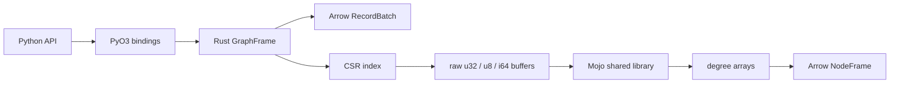

# LynxesMojo

`LynxesMojo` is a Linux-focused toy prototype that grafts a Mojo kernel into
Lynxes, a Rust/PyO3 graph analytics engine built directly on Apache Arrow.

This repository is not meant to replace the original Lynxes project and is not
prepared for PyPI distribution. It exists as a small, inspectable experiment for
a Modular meetup write-up: what does it look like when Mojo contributes a real
graph feature to an existing Rust + Python engine instead of being used only as
a benchmark footnote?

## What Changed

The original Lynxes architecture is preserved:

- Rust owns Arrow `RecordBatch` storage, CSR construction, graph validation,
  lazy plans, Python bindings, I/O, and engine glue.
- Python remains the user-facing API through `import lynxes as lx`.
- Mojo owns one Linux-only graph feature primitive compiled as a shared library.

The Mojo artifact lives at:

```text
kernels/mojo/lynxes_mojo_kernels.mojo
```

It is built into:

```text
py-lynxes/src/lynxes/.libs/liblynxes_mojo_kernels.so
```

Rust loads that `.so` at runtime with `libloading`, sends raw compact CSR buffers
to Mojo, and converts the returned degree arrays back into Arrow-backed
`NodeFrame` results.

## Mojo-Backed Feature

The main feature added by this prototype is:

```python
features = graph.structural_features(edge_type="KNOWS")
```

It returns a `NodeFrame` in original node row order with these appended `Int64`
columns:

- `out_degree`
- `in_degree`
- `total_degree`

`edge_type=None` counts all edges. Passing a string counts only edges of that
type. Isolated nodes are retained and receive zero degrees.

The lazy count aggregation path also uses this Mojo degree kernel:

```python
result = (
    graph.lazy()
    .aggregate_neighbors("KNOWS", lx.count().alias("friend_count"))
    .collect_nodes()
)
```

Other aggregations such as `sum`, `mean`, `list`, `first`, and `last` stay on
the existing Rust executor path because they still need Arrow value evaluation.

This is intentionally Mojo-only behavior. If the Mojo shared library is missing,
`structural_features()` and the Mojo-backed count path fail with an explicit
runtime error instead of silently falling back to Rust.

## Local Build

The Mojo path targets Linux only. On a Windows development machine, use WSL for
the Mojo build and verification steps.

```bash
bash scripts/build_mojo_kernels.sh
export LYNXES_MOJO_LIB="$PWD/py-lynxes/src/lynxes/.libs/liblynxes_mojo_kernels.so"
uv run maturin develop --release
```

Then from Python:

```python
import lynxes as lx

g = lx.read_gf("examples/data/example_simple.gf")
print(g.structural_features())
```

## Commit-Time Mojo Check

Because this repository is commonly edited from Windows while Mojo is validated
on Linux, a Git pre-commit hook is included.

Install it once per checkout:

```powershell
powershell -ExecutionPolicy Bypass -File scripts/install_git_hooks.ps1
```

After that, `git commit` runs:

```bash
bash scripts/check_mojo_kernels.sh
```

The check builds `liblynxes_mojo_kernels.so`, sets `LYNXES_MOJO_LIB`, and runs
the Rust integration test for the Mojo structural feature. When invoked from Git
for Windows, the script tries WSL if `mojo` is not available on the Windows
`PATH`.

## Architecture Snapshot



The important design boundary is that Mojo does not touch Python objects or
Arrow internals directly. It receives primitive buffers, computes graph
structure features, and hands the result back to Rust.

## Why This Is Interesting

For a meetup-sized experiment, the useful question is not "can Mojo beat Rust in
a microbenchmark?" The more interesting question is:

> Can Mojo own a small but real feature inside an existing Python library without
> forcing users to install the Mojo compiler?

This prototype answers that with a narrow yes for Linux:

- end users call a normal Python method;
- Rust keeps the mature packaging, Arrow, and PyO3 boundaries;
- Mojo contributes an actual graph primitive;
- commit-time checks make sure the Mojo code still builds and runs.

That is enough to make the project concrete while keeping the scope honest.

## Repository Map

```text
kernels/mojo/             Mojo kernel source
scripts/                  Mojo build and Git hook helpers
py-lynxes/                Python package namespace and tests
crates/lynxes-core/       Arrow frames, CSR, algorithms, Mojo bridge
crates/lynxes-lazy/       LazyGraphFrame and executor path
crates/lynxes-python/     PyO3 extension module
examples/                 Small local examples
DESIGN.md                 Original engine design notes
Brain.md                  Working memory for this experimental branch
```

Original Lynxes user documentation intentionally does not live in this toy repo;
use the upstream Lynxes repository for the full library docs.
